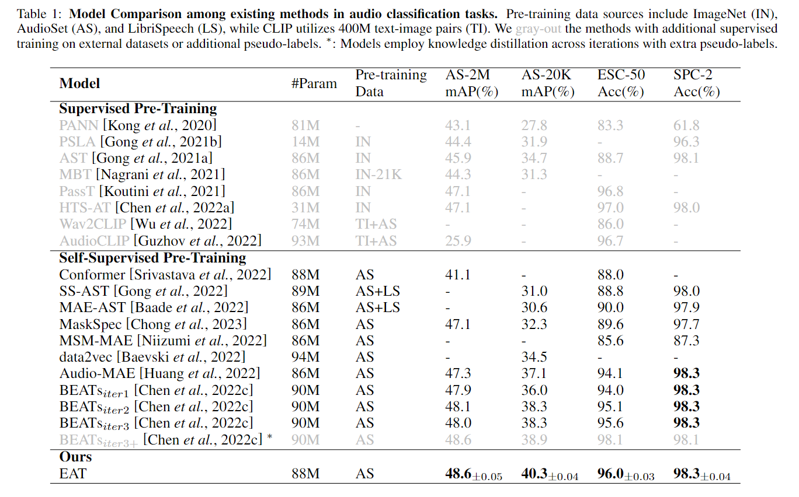
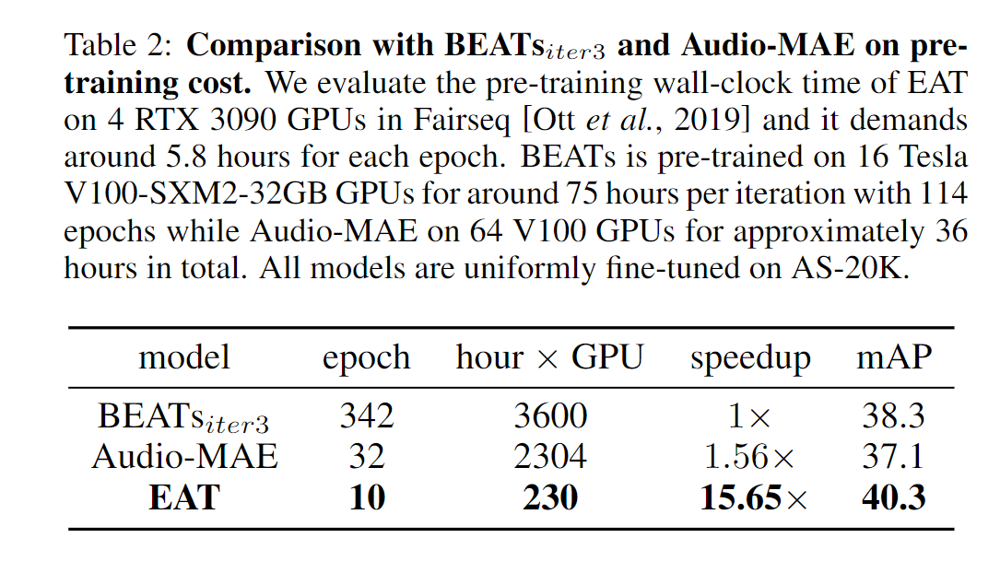

<!-- omit in toc -->
# EAT: Self-Supervised Pre-Training with Efficient Audio Transformer
[](https://www.python.org/)
[](https://pytorch.org/)
[](https://github.com/facebookresearch/fairseq)
[](https://huggingface.co/collections/worstchan/eat-6815b4f1034f5214f9063948)
[](https://arxiv.org/abs/2401.03497)
[](https://github.com/cwx-worst-one/EAT)


**Guides**
- [Requirements and Installation](#requirements-and-installation)
- [Model Checkpoints](#model-checkpoints)
- [Feature Extraction](#feature-extraction)
- [Data Preparation](#data-preparation)
- [Pre-Training](#pre-training)
- [Fine-Tuning](#fine-tuning)
- [Inference and Evaluation](#inference-and-evaluation)


<!-- omit in toc -->
## News 🔥
- [Update May. 3, 2025] 🎉🎉🎉 EAT now supports **[Hugging Face integration](https://huggingface.co/collections/worstchan/eat-6815b4f1034f5214f9063948)**! You can extract features or run inference **without relying on Fairseq** — try EAT as your new audio encoder today!
- We release **EAT-large** (20 epochs) with SOTA performance on AS-2M, AS-20K, ESC-50 and SPC-2. 
- Checkpoints and code are updated — EAT now seamlessly supports **variable-length** audio across training, extraction, inference, and evaluation.


<!-- omit in toc -->
## Introduction 
EAT is an audio SSL model with high effectiveness and efficiency during self-supervised pre-training. You can find details in the paper [EAT: Self-Supervised Pre-Training with Efficient Audio Transformer](https://arxiv.org/abs/2401.03497). 


## Requirements and Installation
The minimum environment requirements are `Python >= 3.8` and `PyTorch >= 1.13`. Please use `pip < 24.1` due to dependency issues.

We now support **[Hugging Face integration](https://huggingface.co/collections/worstchan/eat-6815b4f1034f5214f9063948)** — if you're only performing **feature extraction or inference**, you no longer need to install Fairseq!


### 🟡 For feature extraction or inference only (Hugging Face)
No Fairseq needed. Simply run:
```shell
git clone https://github.com/cwx-worst-one/EAT
cd EAT
pip install -r requirements.txt
```

### 🔵 For pre-training or fine-tuning (Fairseq-based)
You need to install Fairseq manually:

```shell
git clone https://github.com/pytorch/fairseq
cd fairseq
pip install --editable ./
git clone https://github.com/cwx-worst-one/EAT
pip install -r EAT/requirements.txt
```


## Model Checkpoints
We provide several checkpoints for download, including both the original paper version and enhanced variants.


### 🔹 EAT-base (introduced in paper; for efficient pre-training)

- [Pre-trained (10 epochs)](https://drive.google.com/file/d/10pklbY_fKraQUIBizSg1kv4lJXNWxpxl/view?usp=sharing)
- [Fine-tuned on AS-2M](https://drive.google.com/file/d/1F07zN8N54rXU-szvKUlYaCFMCepc4wHR/view?usp=sharing)
- [Fine-tuned on AS-20K](https://drive.google.com/file/d/1fRX_Mgj4sHxV2F6AVfoqXObfgzFMnHRA/view?usp=sharing)


### 🔹 Updated & Recommended Versions
These enhanced versions feature extended pre-training or larger backbones. 
- Checkpoints via **Google Drive** are compatible with Fairseq for further pre-training or fine-tuning.  
- **Hugging Face versions** support direct usage via `AutoModel.from_pretrained` for feature extraction or inference.

| Version| 📦 Google Drive| 🤗 Hugging Face|
|------------| :------------: | :--------: |
| EAT-base (Epoch 30, Pre-trained)| [Link](https://drive.google.com/file/d/19hfzLgHCkyqTOYmHt8dqVa9nm-weBq4f/view?usp=sharing) | [Link](https://huggingface.co/worstchan/EAT-base_epoch30_pretrain)       |
| EAT-base (Epoch 30, Fine-tuned on AS-2M)| [Link](https://drive.google.com/file/d/1aCYiQmoZv_Gh1FxnR-CCWpNAp6DIJzn6/view?usp=sharing) | [Link](https://huggingface.co/worstchan/EAT-base_epoch30_finetune_AS2M)  |
| EAT-large (Epoch 20, Pre-trained)| [Link](https://drive.google.com/file/d/1PEgriRvHsqrtLzlA478VemX7Q0ZGl889/view?usp=sharing) | [Link](https://huggingface.co/worstchan/EAT-large_epoch20_pretrain)      |
| EAT-large (Epoch 20, Fine-tuned on AS-2M) | [Link](https://drive.google.com/file/d/1b_f_nQAdjM1B6u72OFUtFiUu-4yM2shd/view?usp=sharing) | [Link](https://huggingface.co/worstchan/EAT-large_epoch20_finetune_AS2M) |


> 🧠 [Browse collection on Hugging Face](https://huggingface.co/collections/worstchan/eat-6815b4f1034f5214f9063948)  
> ⚠️ Note: Due to our limited AudioSet subset compared to other models, we **recommend** pre-training EAT on your own data for better performance.


### 📈 Performance Summary 
| Model      | Backbone | Params | Pre-train Epochs | AS-20K mAP (%) | AS-2M mAP (%) |
|:-:|:-:|:-:|:-:|:-:|:-:|
|EAT-base|ViT-B|88M|10|40.3 | 48.6|
|EAT-base|ViT-B|88M|30|41.3 | 48.9|
|EAT-large|ViT-L|309M|20|**42.0** | **49.5**|


## Feature Extraction
We provide a simple script to extract audio features from the last layer of the EAT encoder. You can run feature extraction using either a **Fairseq checkpoint** or a **Hugging Face model**.  

To get started, simply run:
```bash
bash EAT/scripts/feature_extract.sh 
``` 

For more detailed instructions, see the [feature extraction guide](./feature_extract/readme.md).


## Data Preparation
The main dataset in our experiment is [AudioSet](https://research.google.com/audioset/). Regrettably, we are unable to distribute the original audio files due to copyright restrictions. 

However, you can access our **data manifest** [here](https://drive.google.com/file/d/1LH2C0q3d4zndoR3-oGkVdYYqDCIdxIsm/view?usp=drive_link), which provides metadata and paths necessary for processing. We follow the file format in [wav2vec](https://github.com/facebookresearch/fairseq/tree/main/examples/wav2vec) and [data2vec](https://github.com/facebookresearch/fairseq/tree/main/examples/data2vec), where `.tsv` format file is for index while `.lbl` and `.csv` format files are specific for classification task.  You are free to modify the files to suit your own datasets or experimental needs.


## Pre-Training 
Our codes are adapted from [Audio-MAE](https://github.com/facebookresearch/AudioMAE) and [data2vec](https://github.com/facebookresearch/fairseq/tree/main/examples/data2vec). The default configuration file for pre-training is `pretraining_AS2M.yaml`. To pre-train the EAT model on AudioSet, simply run the following script:
```bash
bash EAT/scripts/pretraining_AS2M.sh 
``` 
If you wish to pre-train the model on a different dataset where audio clips are **not fixed to 10 seconds**, please refer to the [feature extraction guide](./feature_extract/readme.md) for detailed instructions on how to adjust the target length accordingly.


## Fine-Tuning
We use `finetuning.yaml` as the default configuration file for fine-tuning. To fine-tune the EAT model in different downstream tasks, you could run the script `finetuning_{task}.sh`, where `{task}` refers to one of the supported datasets, including `AS20K`, `AS2M`, `ESC50`, and `SPCv2`. For example, you can fine-tune EAT on `AS20K` by executing: 
```bash
bash EAT/scripts/finetuning_AS20K.sh
``` 


## Inference and Evaluation
We support both local inference and loading models via Hugging Face. To run inference on a single AudioSet audio clip using fine-tuned EAT models, you may use our checkpoint fine-tuned on [AS-2M](https://drive.google.com/file/d/1F07zN8N54rXU-szvKUlYaCFMCepc4wHR/view?usp=sharing) (recommended) or [AS-20K](https://drive.google.com/file/d/1fRX_Mgj4sHxV2F6AVfoqXObfgzFMnHRA/view?usp=sharing). Alternatively, you can load the models directly from Hugging Face.

To start inference, run: 
```bash
bash EAT/scripts/inference.sh 
``` 
An example output is as follows:
```
# top_k_prediction = 12
************ Acoustic Event Inference ************
LABEL                          PREDICTION
Percussion                     0.523
Drum kit                       0.437
Vibraphone                     0.420
Drum                           0.316
Music                          0.303
Snare drum                     0.277
Glockenspiel                   0.225
Marimba, xylophone             0.223
Cymbal                         0.213
Bass drum                      0.207
Hi-hat                         0.196
Mallet percussion              0.170
**************************************************
```

To evaluate on the full AudioSet evaluation set, use:

```bash
bash EAT/scripts/eval.sh 
```

This will report the evaluation value of mAP on the test set. Per-class AP scores are saved to `./EAT/ap_log.txt`. You could also refer to our results of finetuned EAT models on evaluation set of Audioset in `./EAT/results`.


<!-- omit in toc -->
## Performance
Pre-training on AS-2M, EAT gains state-of-the-art (SOTA) performance on several audio and speech classification datasets including AS-20K, AS-2M, ESC-50 and SPC-2.    



<!-- omit in toc -->
## Efficiency
EAT achieves a total pre-training time reduction of ~15x compared to BEATs and ~10x relative to Audio-MAE. The full pre-training on AS-2M requires only 10 epochs.    



<!-- omit in toc -->
## Experiment Logs
We report the experiment logs using [wandb](https://wandb.ai). We have published a  short WandB report detailing the training process and performance metrics of the EAT model. You could visit it [here](https://api.wandb.ai/links/wxc12/obqrpq36).


<!-- omit in toc -->
## TODO 
- [x] Release the final EAT large
- [x] Update codes and checkpoints for friendly usage
- [x] Provide model support on Hugging Face
- [ ] Release the Docker image


## Acknowledgement
Our codebase is based on the awesome [Audio-MAE](https://github.com/facebookresearch/AudioMAE) and [data2vec](https://github.com/facebookresearch/fairseq/tree/main/examples/data2vec) repo. 


## Institutional Contributors
|  Institution | Contribution |
|:------|:-----|
| [Shanghai Jiao Tong University](https://www.seiee.sjtu.edu.cn/) | Researchers; Computing power |
| [Peng Cheng Laboratory](https://data-starcloud.pcl.ac.cn/) | Researchers; Computing power |


<!-- omit in toc -->
## Citation
If you find our EAT codes and models useful, please cite the following paper:
```
@inproceedings{ijcai2024p421,
  title     = {EAT: Self-Supervised Pre-Training with Efficient Audio Transformer},
  author    = {Chen, Wenxi and Liang, Yuzhe and Ma, Ziyang and Zheng, Zhisheng and Chen, Xie},
  booktitle = {Proceedings of the Thirty-Third International Joint Conference on
               Artificial Intelligence, {IJCAI-24}},
  publisher = {International Joint Conferences on Artificial Intelligence Organization},
  editor    = {Kate Larson},
  pages     = {3807--3815},
  year      = {2024},
  month     = {8},
  note      = {Main Track},
  doi       = {10.24963/ijcai.2024/421},
  url       = {https://doi.org/10.24963/ijcai.2024/421},
}
```

<!-- omit in toc -->

