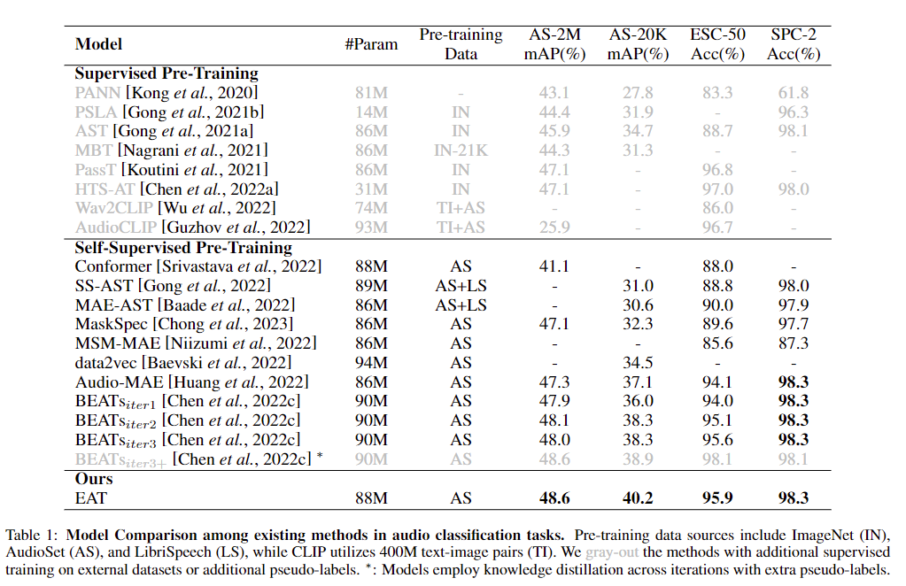
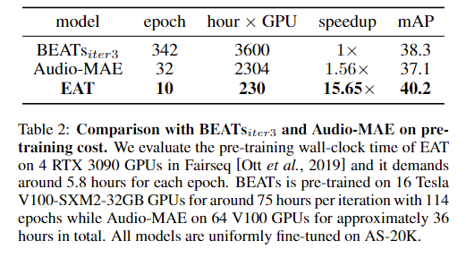

# EAT
[](https://github.com/cwx-worst-one/EAT)
[](https://github.com/cwx-worst-one/EAT)
[](https://github.com/cwx-worst-one/EAT)
[](https://github.com/cwx-worst-one/EAT)

## Introduction 
EAT is an audio SSL model with high effectiveness and efficiency in pre-training. Adopting the bootstrap paradigm, we propose the Utterance-Frame Objective (UFO) and adapt the inverse block masking on audio patches during its self-supervised training. You can find details in the paper [EAT: Self-Supervised Pre-Training with Efficient Audio Transformer](https://arxiv.org/abs/2401.03497). 

## Performance
Pre-training on AS-2M, EAT gain state-of-the-art (SOTA) performance on several audio and speech classification datasets including AS-20K, AS-2M, ESC-50 and SPC-2.  



## Efficiency
EAT achieves a total pre-training time reduction of ~15x compared to BEATs$_{iter3}$ and ~10x relative to Audio-MAE. It costs only 10 epochs during EAT's pre-training on AS-2M. 
  

## Pre-trained and Fine-tuned Models
TODO

## Feature Extraction
TODO

## Pre-training 
TODO

## Fine-tuning
TODO

## TODO 
- [ ] release the main pre-trained codes and pre-trained EAT model
- [ ] release the fine-tuned codes and fine-tuned EAT models (in AS tasks)
- [ ] release the inferrence codes 

## Citation
If you find our EAT code and paper useful, please cite:
```
@article{chen2024eat,
  title={EAT: Self-Supervised Pre-Training with Efficient Audio Transformer},
  author={Chen, Wenxi and Liang, Yuzhe and Ma, Ziyang and Zheng, Zhisheng and Chen, Xie},
  journal={arXiv preprint arXiv:2401.03497},
  year={2024}
}
```